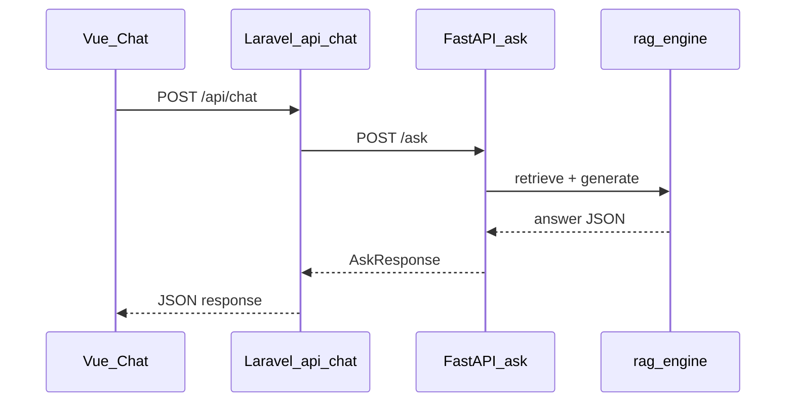

# Architecture

System overview for developers working on Warhammer Rule Assistant.

## Request Flow



1. The user submits a question in the Vue chat UI.
2. Laravel validates the request and forwards it to the Python AI service.
3. Python loads the FAISS index for the selected game, retrieves relevant rules chunks, and asks the LLM to answer from that context.
4. The JSON response is returned through Laravel to the frontend.

## Component Map

| Layer | Key files | Role |
|-------|-----------|------|
| Frontend | `resources/js/pages/Chat.vue`, `resources/js/pages/Rules.vue` | Chat UI and core rules PDF viewer |
| Laravel API | `routes/api.php`, `app/Http/Controllers/ChatController.php`, `app/Services/AiService.php` | Validates input, proxies to Python |
| Python API | `python/web_rules_qa.py` | FastAPI wrapper; loads FAISS indexes at startup |
| RAG core | `python/rag_engine.py` | Retrieval and LLM answer generation |
| Indexing | `python/build_index.py` | Builds FAISS indexes from markdown rules files |

## Laravel Chat API

**Endpoint:** `POST /api/chat`

**Request body:**

| Field | Type | Required | Notes |
|-------|------|----------|-------|
| `question` | string | One of `question` or `message` | The rules question |
| `message` | string | One of `question` or `message` | Alias for `question` |
| `game` | string | Yes | `aos`, `40k`, or `wh40k` |

**Success response** (mirrors the Python `AskResponse`):

```json
{
  "short_answer": "...",
  "detailed_answer": "...",
  "source": "...",
  "certainty": 4
}
```

**Validation errors:** HTTP 422 when the question is missing or `game` is invalid.

**AI service failure:** HTTP 200 with an error passthrough:

```json
{
  "error": "AI service request failed",
  "status": 503,
  "body": "..."
}
```

Laravel normalizes `40k` to `wh40k` before forwarding to Python.

## Python Ask API

**Endpoint:** `POST /ask`

**Request body:**

```json
{
  "question": "Can I reinforce this unit?",
  "game": "aos"
}
```

`game` must be `aos` or `wh40k`.

**Response body:**

```json
{
  "short_answer": "...",
  "detailed_answer": "...",
  "source": "...",
  "certainty": 4
}
```

Interactive docs are available at `http://127.0.0.1:8001/docs` when the Python service is running.

## Rules PDF Viewer

Core rule PDFs are served from `public/rulebooks/`:

- AoS: `/rulebooks/AOS_Core_Rules.pdf`
- 40K: `/rulebooks/40K_Core_Rules.pdf`

The `/rules` page renders PDFs through PDF.js. Tag deep-linking uses JSON mappings in `data/datafiles-Tags/` (`40K-Tags.json`, `AOS-Tags.json`), imported by `resources/js/utils/ruleTagLinks.js`.

## Dev Commands

| Command | Purpose |
|---------|---------|
| `composer dev` | Laravel server, Vite, and queue worker |
| `composer test` | Pint lint check + Pest tests |
| `npm run lint` | ESLint (frontend) |
| `npm run test` | JavaScript unit tests |
| `python -m unittest discover -s python/tests` | Python unit tests |

See [setup.md](setup.md) for first-time setup and [data.md](data.md) for the rules data pipeline.
